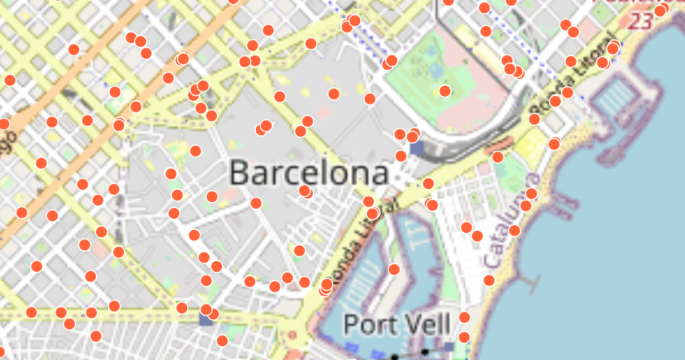
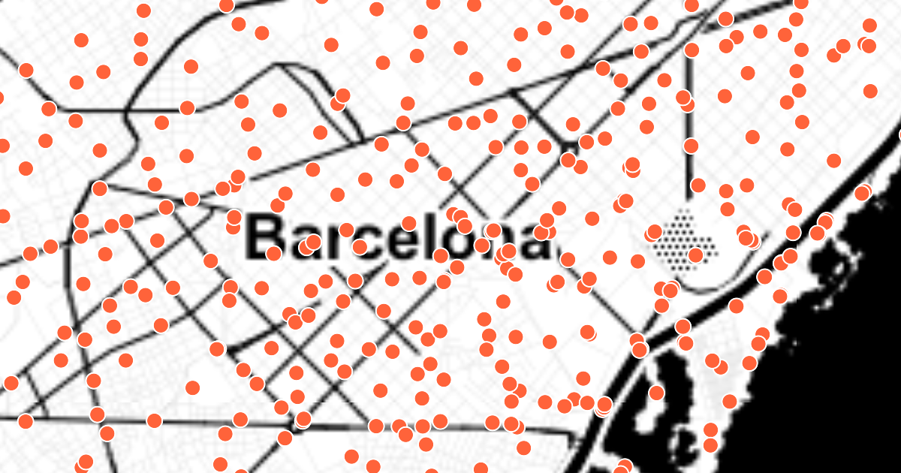
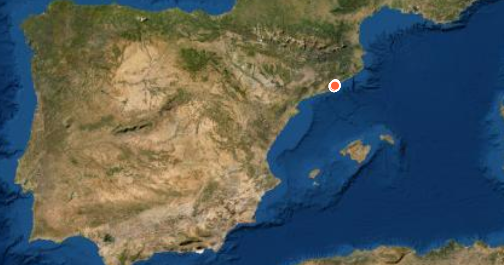

# Carto Plugin

This plugin designed for [MapLibre GL JS](https://maplibre.org) adds a style later based on vector tiles served from [Carto.com](https://carto.com).

## Example

Add data from the Carto Workshop on *bicing Barcelona*.  For details on how Carto works, please see:

* https://github.com/CartoDB/carto-workshop
* https://cartoworkshops.carto.com/u/carto-workshops/tables/biking\_sheet1/public

## Examples of the Carto Vector Tiles

This shows the *bicing Barcelona* data set, a series of bike locations, as vector tiles served from Carto.

Base map style:  *Open Street Map*

Base map style:  *Stamen Water Color*

Base map style:  *ArcGIS World Imagery*

---

## Live Demo
* https://raw.githack.com/nationalparkservice/npmap5-plugins/maplibre-gl-carto-source/examples/index.html
