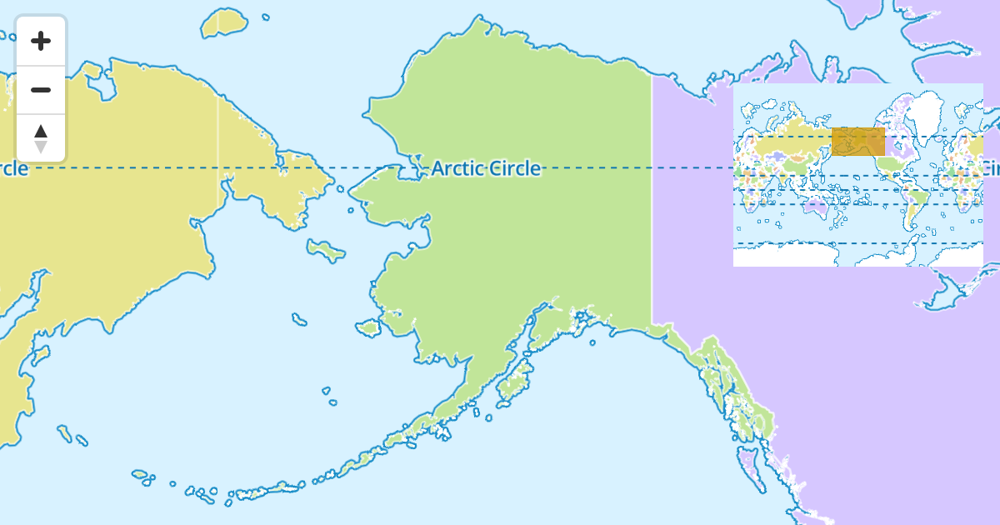
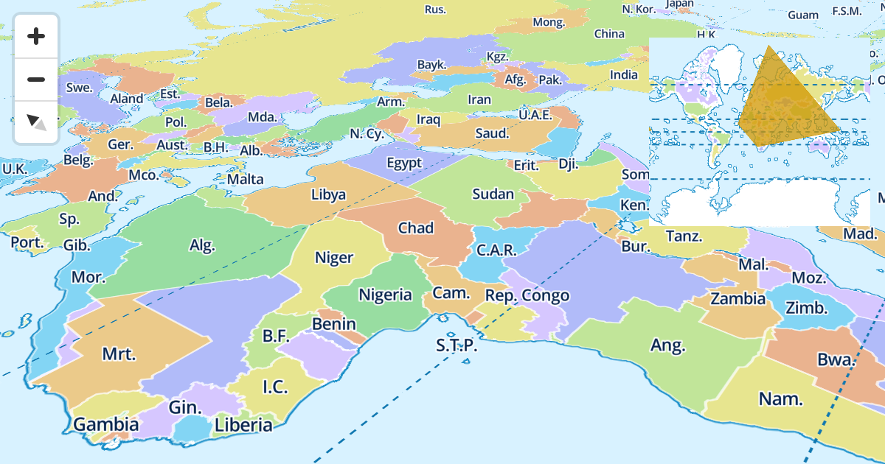

# MapLibre Overview Map Plugin

This plugin designed for [MapLibre GL JS](https://maplibre.org) adds a overview or mini-map of the current map.

## Live Demo

*  [examples/index.html](https://raw.githack.com/roblabs/npmap5-plugins/maplibre-gl-overview/examples/index.html)

## Examples

*The location of the Overview inset can be configured for any corner of the map.*


*The Overview plugin takes into account the `pitch` & `bearing`.*


***

## Test

### Developing

Build, then start a local webserver and serve up the example.

```bash
# For developing
npm run build

# Update API section of README
npm run documentation

# Start local http server
npm run serve

# open example HTML in default browser
#   check console for the full URL
npm run openurl

# Open in other browsers if they are not the default
npm run openurlchrome
npm run openurlfirefox
```

***

## API

<!-- Generated by documentation.js. Update this documentation by updating the source code. -->

#### Table of Contents

*   [position](#position)
*   [scrollZoom](#scrollzoom)
*   [\_keyboardPanStep](#_keyboardpanstep)

### position

Where to display the control "top-left" | "top-right" | "bottom-left" | "bottom-right"

Type: ControlPosition

### scrollZoom

True/false allow scroll on zoom

Type: [boolean](https://developer.mozilla.org/docs/Web/JavaScript/Reference/Global_Objects/Boolean)

### \_keyboardPanStep

Amount of pixel to pan map on keypress, defaults to 15

Type: [number](https://developer.mozilla.org/docs/Web/JavaScript/Reference/Global_Objects/Number)
